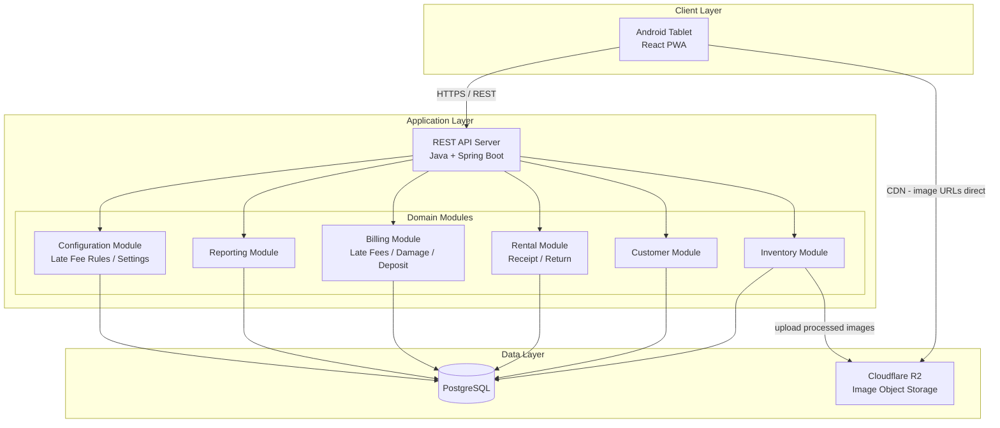
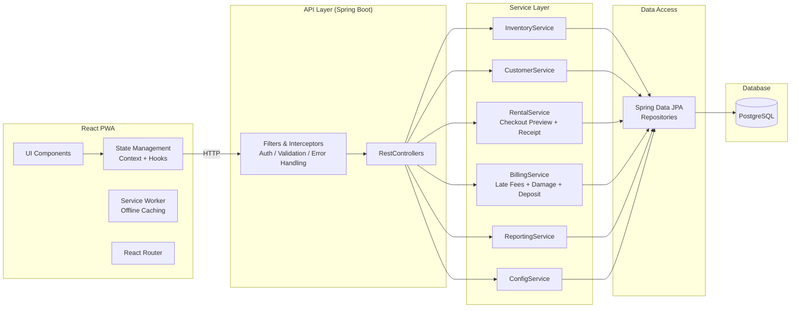
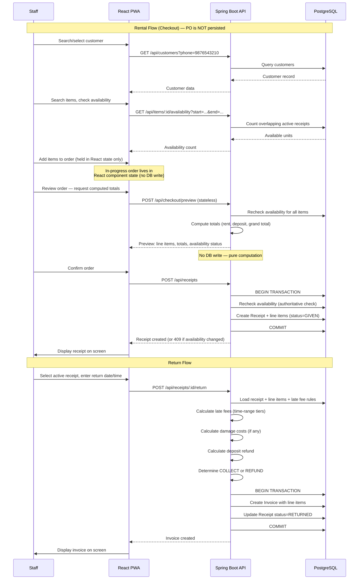
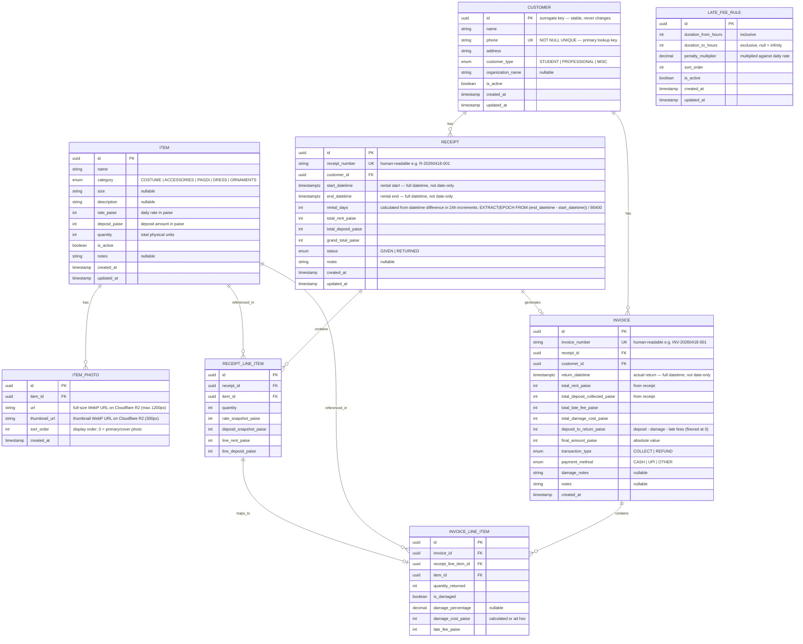
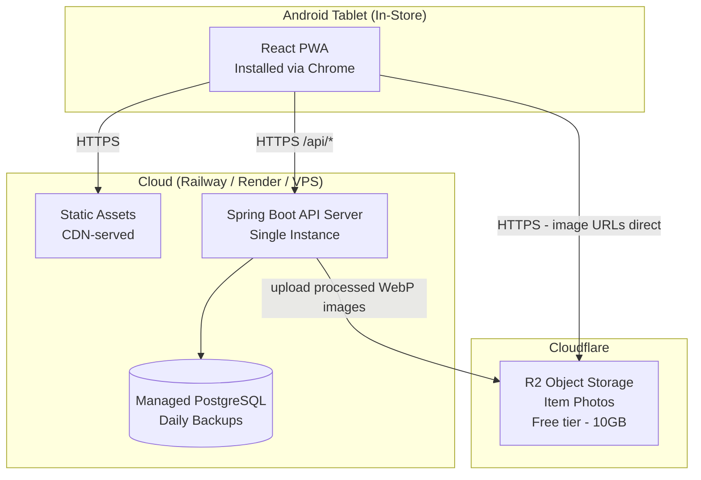

# Technical Architecture Document
## Fashion Rental Management Application
### Point-of-Sale & Operations Platform for Physical Rental Shop

---

**Document Version:** 1.4
**Prepared By:** Technical Architecture
**Date:** April 18, 2026
**Based On:** Product Discovery Document v1.1 (April 18, 2026)
**Status:** Draft

**Changelog:**

| Version | Date | Changes |
|---------|------|---------|
| 1.0 | April 18, 2026 | Initial draft |
| 1.1 | April 18, 2026 | Backend technology change: Node.js + Express + TypeScript replaced with Java 21 + Spring Boot 3.x. Updated ORM from Prisma to Spring Data JPA + Hibernate. Updated logging, testing, validation, deployment, and security sections accordingly. |
| 1.2 | April 18, 2026 | Three architectural decisions made: (1) PO removed as a persisted entity — replaced by a stateless checkout preview endpoint; PURCHASE_ORDER and PO_LINE_ITEM tables removed from schema. (2) Receipt and Invoice confirmed as two separate entities (state machine / single-entity approach rejected). (3) Customer PK changed from phone number to UUID; phone retained as NOT NULL UNIQUE with a unique index. API design, ERD, and sequence diagram updated accordingly. ADR-007, ADR-008, ADR-009 added. |
| 1.3 | April 18, 2026 | Image storage architecture added. Cloudflare R2 selected as object storage provider (ADR-010). Image storage subsection added to Section 3 (Technology Stack) and Section 4 (System Architecture). Upload API endpoints added to Section 4.2. ITEM_PHOTO entity updated with thumbnail_url field in ERD (Section 5.1). Image storage row added to full stack summary table. |
| 1.4 | April 18, 2026 | Datetime-based rental periods confirmed (OQ-3 resolved): start_date/end_date on RECEIPT renamed to start_datetime/end_datetime and changed to TIMESTAMP WITH TIME ZONE. rental_days description updated to reflect 24h-increment calculation. Minimum 1-day rental enforced at service layer (OQ-5 resolved). Late fee algorithm updated to use timestamp parameters; early-return non-refund policy documented. Return flow sequence diagram updated to datetime precision. Checkout and receipt creation endpoints updated to use ISO 8601 datetime strings. Key data model decisions updated with datetime calculation formulas. OQ-6 (damaged beyond repair) and OQ-13 (same-day re-rental) confirmed as no architectural impact. Section 11 risks updated: R1 removed (OQ-3 resolved), R2 clarified, resolved open questions removed. Section 9 MVP risk flags updated. |

---

## Table of Contents

1. [Problem Statement & Technical Requirements](#1-problem-statement--technical-requirements)
2. [Architecture Overview](#2-architecture-overview)
3. [Technology Stack Recommendations](#3-technology-stack-recommendations)
4. [System Architecture](#4-system-architecture)
5. [Data Model](#5-data-model)
6. [Infrastructure & Deployment](#6-infrastructure-and-deployment)
7. [Security Considerations](#7-security-considerations)
8. [Observability](#8-observability)
9. [Development Phases](#9-development-phases)
10. [Architecture Decision Records (ADRs)](#10-architecture-decision-records)
11. [Risks & Mitigations](#11-risks--mitigations)
12. [Estimated Effort](#12-estimated-effort)

---

## 1. Problem Statement & Technical Requirements

### Problem Summary

A physical fashion rental shop in India currently operates on manual paper-based processes. The shop needs a digital platform to manage inventory, customer registration, rental billing, return processing (with late fees and damage assessment), and basic financial reporting. The system will be used in-store on an Android tablet by 1-3 staff members.

### Technical Requirements

| Requirement | Detail |
|-------------|--------|
| **Platform** | Android tablet (app or responsive web) |
| **Concurrent users** | 1-3 max |
| **Transaction volume** | Dozens per day, hundreds of inventory items |
| **Currency** | INR only |
| **Location** | Single physical shop |
| **Authentication** | Shared login for MVP; role-based in Phase 2 |
| **Offline capability** | Desirable for in-store reliability; not explicitly required |
| **Print** | On-screen display for MVP; printer integration in Phase 2 |
| **Integrations** | None for MVP |
| **Data sensitivity** | Customer PII (name, phone, address); financial transaction data |
| **Performance** | Inventory lookup < 30s; customer search < 5s; receipt creation < 3 min end-to-end |

### Key Domain Complexity

The system is operationally simple but has non-trivial billing logic:

- **Hybrid inventory model:** Pool-count tracking for identical items, individual entries for unique items.
- **Late fee engine:** Configurable time-range tiers (sub-day granularity: 3hr, 6hr, 1day, 2day, n-day) with penalty multipliers against daily rate.
- **Damage cost:** Percentage-based calculation (damage % x item rate) with ad hoc flat-amount override.
- **Invoice transaction type:** COLLECT or REFUND with positive amounts (no negative amounts).
- **Checkout preview → Receipt workflow:** A stateless checkout preview computes totals on the fly; confirmation creates a Receipt atomically with an availability recheck in a DB transaction.

---

## 2. Architecture Overview

### Recommendation: Modular Monolith

For this application, a **modular monolith** is the correct architecture. This is not a close decision.

**Why not microservices:**

- Team size is 1-2 developers. Microservices add operational overhead (service discovery, inter-service communication, distributed tracing, independent deployments) that is unjustifiable for this scale.
- Transaction volume is dozens per day. There is no scaling bottleneck that requires independent service scaling.
- The domain is tightly coupled -- a receipt touches inventory, customers, billing, and late fee rules simultaneously. Splitting these across services creates distributed transaction problems for zero benefit.
- Infrastructure cost multiplies with each service (separate containers, databases, monitoring).

**Why modular monolith over a flat monolith:**

- Clean module boundaries (inventory, customer, rental, billing, reporting) make the codebase navigable and testable.
- If the business grows to multi-location or e-commerce (Phase 3+), modules can be extracted into services incrementally.
- Enforced boundaries prevent the "big ball of mud" problem common in small-team projects.

### High-Level Architecture



---

## 3. Technology Stack Recommendations

### 3.1 Frontend Framework

| Option | Pros | Cons |
|--------|------|------|
| **React (PWA)** | Largest ecosystem, abundant talent in India, PWA gives offline + install-to-homescreen on Android, excellent tablet responsiveness | Requires discipline for state management |
| **Flutter (Cross-platform)** | Native Android app, good UI toolkit, offline-first with local DB | Smaller hiring pool, heavier build toolchain, overkill for a forms-based CRUD app |
| **Plain HTML + HTMX** | Simplest possible stack, no build step | Poor offline story, limited interactivity for complex forms (multi-item receipt builder) |

**Recommendation: React as a Progressive Web App (PWA)**

Rationale:
- PWA installed on Android tablet looks and feels like a native app (full-screen, home screen icon, splash screen).
- Service worker provides basic offline caching for static assets and can be extended for offline data if needed later.
- React is the most commonly known frontend framework in India, maximizing the hiring pool for a small budget.
- The receipt/PO builder (adding multiple items, real-time total calculation, date pickers) benefits from React's component model and state management.
- When Phase 3 requires a customer-facing web portal, the same React codebase or component library can be reused.

**UI Component Library:** Use **Ant Design** or **shadcn/ui** -- both provide production-ready form components, tables, date pickers, and responsive layouts out of the box. Ant Design is particularly good for data-dense admin interfaces. shadcn/ui is lighter and more customizable. Either is fine; pick based on developer preference.

### 3.2 Backend Framework

| Option | Pros | Cons |
|--------|------|------|
| **Java + Spring Boot** | Strong typing, mature ecosystem (Spring Data JPA, Spring Security, Spring Validation, Actuator), excellent for complex business logic, large enterprise talent pool in India, robust for billing calculations | Higher memory footprint (~256-512MB), slightly slower startup than Node.js, two languages in the stack (Java + TypeScript) |
| **Node.js + Express/Fastify** | Same language as frontend (TypeScript throughout), fast development, huge ecosystem, low memory footprint | Less mature ecosystem for enterprise patterns, manual wiring for security/validation |
| **Python + Django/FastAPI** | Django has built-in admin panel, ORM, auth; FastAPI is modern and fast | Two languages in the stack, Django is opinionated (can be good or bad) |

**Recommendation: Java 21 with Spring Boot 3.x**

Rationale:
- Strong typing with Java provides compile-time safety for the billing logic, which is the most error-prone part of the system. Late fee calculations, damage cost computations, and deposit refund logic benefit from Java's type system and BigDecimal-like precision (though we use integer paise).
- Spring Boot's mature ecosystem provides battle-tested solutions out of the box: Spring Data JPA for PostgreSQL access with automatic repository generation, Spring Security for authentication (MVP) and role-based access control (Phase 2), Bean Validation (Hibernate Validator) for input validation, and Spring Actuator for health checks and metrics.
- Spring Data JPA + Hibernate is an excellent fit for the relational data model. JPA repositories eliminate boilerplate CRUD code, and Hibernate's lazy loading, caching, and query optimization handle the multi-entity joins (receipt -> line items -> items) efficiently.
- Java has one of the largest developer talent pools in India, especially for enterprise applications. This minimizes hiring risk and ensures long-term maintainability.
- The billing domain (late fee tiers, damage percentages, deposit refund calculations, COLLECT vs. REFUND determination) benefits from Java's object-oriented patterns -- strategy pattern for fee calculation, service layer for transaction orchestration.
- The trade-off of two languages (Java backend + TypeScript frontend) is acceptable. The frontend and backend communicate via a well-defined REST API, and each language is used where it excels.

### 3.3 Database

| Option | Pros | Cons |
|--------|------|------|
| **PostgreSQL** | Robust, full SQL, excellent for relational data with complex queries (reporting), JSON support for flexible fields, free | Requires a server (managed options available cheaply) |
| **SQLite** | Zero infrastructure, embedded, perfect for single-user apps | No concurrent write support (problematic even with 2-3 users), harder to back up live, no remote access for debugging |
| **MySQL** | Widely available, cheap hosting in India | Fewer features than PostgreSQL, weaker for complex queries |

**Recommendation: PostgreSQL**

Rationale:
- The data model is inherently relational (customers, items, receipts, line items, invoices, late fee rules). PostgreSQL handles this naturally.
- Reporting queries (daily revenue, outstanding deposits, overdue rentals) benefit from PostgreSQL's window functions, CTEs, and date/time handling.
- The late fee engine requires precise time-range calculations. PostgreSQL's `interval` and `tstzrange` types are purpose-built for this.
- Managed PostgreSQL is available cheaply on all cloud providers (including Indian options like Railway, Supabase, or Neon with free tiers).
- Supports concurrent access from 2-3 users without issues.
- If multi-location (Phase 3) requires a shared database, PostgreSQL scales far beyond what this application will ever need.

### 3.4 ORM / Data Access

**Recommendation: Spring Data JPA + Hibernate**

- Spring Data JPA provides repository interfaces that auto-generate CRUD operations, eliminating boilerplate data access code.
- Hibernate 6.x as the JPA implementation offers mature ORM capabilities: entity mapping, lazy/eager loading, first-level and second-level caching, and query optimization.
- JPA entity annotations provide a declarative, type-safe mapping between Java objects and database tables.
- JPQL and the Criteria API handle the complex relational queries this application needs (e.g., availability checks joining receipts and line items, reporting aggregations).
- Database migrations are handled by Flyway, providing versioned, repeatable migration scripts.
- Excellent integration with the Spring Boot ecosystem -- auto-configuration, transaction management via `@Transactional`, and integration with Spring Security and Validation.

### 3.5 Image Storage

Item photos (costumes, accessories, dresses) are uploaded by staff and displayed during inventory browsing and on on-screen receipts/invoices. This requires dedicated object storage — storing images in PostgreSQL or on the application server's local filesystem are both unacceptable approaches.

**Options considered:**

| Approach | Verdict | Reason |
|---|---|---|
| **PostgreSQL BYTEA / BLOB** | Rejected | Bloats the database — backups balloon from MB to GB. Slows queries on the `item_photo` table. Images are binary assets that relational databases handle poorly. Not worth the trade-off when object storage is free. |
| **Application server local filesystem** | Rejected | Railway and Render use ephemeral containers. Every redeploy wipes the local filesystem and all uploaded images are lost. Not viable on any PaaS or container-based deployment. |
| **AWS S3** | Rejected for MVP | Reliable but has egress fees ($0.09/GB). Free tier expires after 12 months. Overkill at this scale. |
| **Backblaze B2** | Strong alternative | $0.006/GB/month with free egress via Cloudflare. Better economics than S3 at scale. Slightly more complex SDK configuration than R2. Worth evaluating if R2 free tier is ever exceeded. |
| **Cloudflare R2** | **Selected** | Free tier: 10 GB storage, 1M write requests/month, 10M read requests/month. Zero egress fees. S3-compatible API (works with the AWS SDK v2 via a custom endpoint URL). Images served directly from R2's public CDN URL — no bandwidth cost when displayed on the tablet. A small shop with hundreds of items and 5–10 photos each will likely never pay anything. |

**Recommendation: Cloudflare R2**

**Image processing on upload:**

Costumes photographed on Android phones produce 3–8 MB JPEG files at 4000+ px resolution. These must be processed before storage:

1. Reject uploads exceeding 15 MB (fail fast).
2. Resize to **max 1200px** on the longest side for the full-size image (detail view, receipt display).
3. Generate a **300px** thumbnail for inventory list and grid views.
4. Convert both to **WebP** (~30–50% smaller than JPEG at equivalent quality; supported on all modern Android Chrome).
5. Cap at **8 photos per item** — enough for front/back/detail shots; enforced in the upload endpoint.

Two files are stored per upload: `items/{itemId}/{uuid}-full.webp` and `items/{itemId}/{uuid}-thumb.webp`. Both URLs are persisted in the `item_photo` table.

**Spring Boot implementation:**

```
inventory/
  service/
    ImageStorageService.java                  ← interface (provider-agnostic)
    CloudflareR2ImageStorageService.java      ← R2 implementation via AWS SDK v2
    ImageProcessingService.java               ← resize + WebP conversion (Thumbnailator)
  controller/
    ItemPhotoController.java                  ← upload / delete / reorder endpoints
  entity/
    ItemPhoto.java                            ← JPA entity
  dto/
    ItemPhotoResponse.java                    ← { id, url, thumbnailUrl, sortOrder }
```

The `ImageStorageService` interface isolates the cloud provider. Swapping R2 for another provider means writing a new implementation class only — no changes to controllers or business logic.

**Dependencies:**

- `software.amazon.awssdk:s3` (v2) — R2 is S3-compatible; connect via `endpointOverride` to `https://<account-id>.r2.cloudflarestorage.com`
- `net.coobird:thumbnailator` — resize and format conversion (WebP via ImageIO)

**Configuration (application.yml):**

```yaml
app:
  storage:
    r2:
      account-id: ${R2_ACCOUNT_ID}
      access-key-id: ${R2_ACCESS_KEY_ID}
      secret-access-key: ${R2_SECRET_ACCESS_KEY}
      bucket-name: ${R2_BUCKET_NAME}
      public-url-base: ${R2_PUBLIC_URL_BASE}   # e.g. https://pub-xxx.r2.dev
    image:
      max-upload-bytes: 15728640   # 15 MB
      full-max-px: 1200
      thumb-max-px: 300
      max-photos-per-item: 8
```

### 3.6 Full Stack Summary

| Layer | Technology | Justification |
|-------|-----------|---------------|
| Frontend | React 18+ (TypeScript) as PWA | Tablet-friendly, offline-capable, largest talent pool |
| UI Library | Ant Design or shadcn/ui + Tailwind | Production-ready components for data-dense UI |
| Backend | Java 21 + Spring Boot 3.x | Strong typing, mature ecosystem, robust for billing logic, large talent pool in India |
| ORM | Spring Data JPA + Hibernate 6.x | Type-safe repositories, declarative entity mapping, mature relational query support |
| Database | PostgreSQL 16 | Relational strength, time/date handling, reporting queries |
| Image Storage | Cloudflare R2 | Free tier covers full shop needs; zero egress fees; S3-compatible API; CDN delivery |
| API Style | REST (JSON) | Simple, well-understood, sufficient for this scale |
| Auth | Spring Security with shared credentials (MVP) | Built-in authentication; seamless upgrade to role-based access in Phase 2 |
| Validation | Bean Validation (Hibernate Validator) for backend, Zod for frontend | Annotation-based validation on DTOs and entities |
| Build/Bundle | Vite (frontend), Maven or Gradle (backend) | Fast frontend builds; standard Java build tooling for backend |
| Testing | JUnit 5 + Mockito (backend), Playwright (e2e) | Industry-standard Java testing; reliable end-to-end browser testing |

---

## 4. System Architecture

### 4.1 Component Architecture



### 4.2 API Design

REST API with resource-oriented endpoints, implemented as Spring `@RestController` classes. Each resource group (items, customers, checkout, receipts, invoices, config, reports) maps to a dedicated controller class. Request/response DTOs are validated using Bean Validation annotations (`@NotNull`, `@Size`, `@Min`, etc.). All amounts are integers in paise (1 INR = 100 paise) to avoid floating-point errors.

**Note on PO (Purchase Order):** PO is not persisted. The checkout preview is a stateless computation endpoint — it validates availability and returns calculated totals without writing to the database. The frontend holds the in-progress order in React component state. On confirmation, a Receipt is created atomically with an availability recheck inside a DB transaction.

#### Core Endpoints

```
# Inventory
GET    /api/items                    # List/search items (query: search, category, size)
GET    /api/items/:id                # Get item details
POST   /api/items                    # Create item
PUT    /api/items/:id                # Update item
GET    /api/items/:id/availability   # Check availability for date range (query: startDate, endDate)

# Item Photos
GET    /api/items/:id/photos         # List photos for an item (returns [{ id, url, thumbnailUrl, sortOrder }])
POST   /api/items/:id/photos         # Upload photo (multipart/form-data, field: file; max 15MB, max 8 photos/item)
                                     # Spring Boot resizes + converts to WebP, uploads full + thumbnail to R2,
                                     # stores both URLs in item_photo table. Returns { id, url, thumbnailUrl, sortOrder }.
DELETE /api/items/:id/photos/:photoId  # Delete photo (removes from R2 and item_photo table)
PATCH  /api/items/:id/photos/order   # Reorder photos (body: [{ id, sortOrder }])

# Customers
GET    /api/customers                # Search customers (query: phone, name)
GET    /api/customers/:id            # Get customer with rental history
POST   /api/customers                # Register customer
PUT    /api/customers/:id            # Update customer

# Checkout (Stateless Preview — no DB write)
POST   /api/checkout/preview         # Validate availability + compute totals; returns breakdown
                                     # Body: { customerId, items: [{itemId, quantity}], startDatetime, endDatetime }
                                     # startDatetime and endDatetime are ISO 8601 datetime strings (e.g. "2026-04-18T10:00:00+05:30"), NOT date-only strings.
                                     # Response: { available: true|false, lineItems, totalRent, totalDeposit, grandTotal, rentalDays }
                                     # No side effects. Frontend calls this when the staff reviews the order.

# Receipts
POST   /api/receipts                 # Confirm checkout -> creates Receipt atomically (availability rechecked in DB transaction)
                                     # Body: { customerId, items: [{itemId, quantity}], startDatetime, endDatetime, ... }
                                     # startDatetime and endDatetime are ISO 8601 datetime strings (e.g. "2026-04-18T10:00:00+05:30"), NOT date-only strings.
GET    /api/receipts                 # List receipts (query: status, customerId, overdue)
GET    /api/receipts/:id             # Get receipt details
POST   /api/receipts/:id/return      # Process return -> creates Invoice

# Invoices
GET    /api/invoices                 # List invoices (query: dateRange)
GET    /api/invoices/:id             # Get invoice details

# Configuration
GET    /api/config/late-fee-rules    # Get late fee tiers
PUT    /api/config/late-fee-rules    # Update late fee tiers

# Reports
GET    /api/reports/daily-revenue    # Daily revenue summary (query: date)
GET    /api/reports/outstanding-deposits  # All held deposits
GET    /api/reports/overdue-rentals  # All overdue active receipts
```

### 4.3 Core Business Logic Flow



### 4.4 Late Fee Calculation Algorithm

This is the most complex piece of business logic. It will be implemented as a Spring `@Service` class (`LateFeeCalculationService`) with the core algorithm isolated for unit testing. Pseudocode:

```
function calculateLateFee(endDatetime, returnDatetime, dailyRate, lateFeeRules):
    // Both endDatetime and returnDatetime are timestamps (TIMESTAMP WITH TIME ZONE).
    // Minimum rental is 1 day. Early returns (returnDatetime < endDatetime) are not
    // refunded — the customer is charged the full rental duration. No late fee applies.
    overdueHours = diffInHours(endDatetime, returnDatetime)
    // overdueHours = EXTRACT(EPOCH FROM (returnDatetime - endDatetime)) / 3600

    if overdueHours <= 0:
        return 0

    // Sort rules by duration_from ascending
    rules = sortBy(lateFeeRules, 'duration_from_hours')

    // Find the matching tier
    matchedRule = rules.findLast(rule => overdueHours >= rule.duration_from_hours)

    if matchedRule is null:
        // Fallback: default 1.5x per overdue day
        overdueDays = ceil(overdueHours / 24)
        return dailyRate * 1.5 * overdueDays

    return dailyRate * matchedRule.penalty_multiplier
```

Note: The exact calculation (whether the multiplier applies once per tier or scales with duration) is pending client confirmation. The engine should be designed so this logic is isolated and easily modified.

---

## 5. Data Model

### 5.1 Entity Relationship Diagram



### 5.2 Key Data Model Decisions

**Rental periods are datetime-based (not date-based).** `start_datetime` and `end_datetime` on RECEIPT are `TIMESTAMP WITH TIME ZONE`. Rental days = `EXTRACT(EPOCH FROM (end_datetime - start_datetime)) / 86400`. Overdue hours (for late fee calculation) = `EXTRACT(EPOCH FROM (return_datetime - end_datetime)) / 3600`. `return_datetime` on INVOICE is likewise `TIMESTAMP WITH TIME ZONE`. Minimum rental is 1 day — enforced at the service layer. Early returns (return before `end_datetime`) are not refunded; the full rental duration is charged.

**All monetary amounts stored in paise (integer).** 1 INR = 100 paise. This eliminates floating-point precision issues entirely. Display conversion to INR happens at the API response / UI layer.

**Snapshot pricing on line items.** When a Receipt is created, the item's current rate and deposit are copied to `rate_snapshot_paise` and `deposit_snapshot_paise`. This ensures that future price changes do not affect existing rentals.

**Availability calculation.** Available units for an item on a date range = `item.quantity - COUNT(receipt_line_items where receipt.status = 'GIVEN' AND date ranges overlap)`. This is a query, not a stored field, ensuring consistency.

**Receipt number format.** Human-readable sequential numbers per day (e.g., `R-20260418-001`). Generated server-side with a database sequence or date-partitioned counter.

**PO (Purchase Order) is not persisted.** The in-progress order lives in React component state in the browser. The backend provides a stateless `POST /api/checkout/preview` endpoint that validates availability and computes totals without writing to the database. Receipt creation (`POST /api/receipts`) rechecks availability atomically inside a DB transaction and returns a 409 Conflict if any item is no longer available. See ADR-007.

**Customer uses UUID PK; phone is a unique indexed column.** The `customers.id` column is a UUID surrogate key. The `phone` column is `NOT NULL UNIQUE` with an index — it is the primary lookup key used in all staff searches. Foreign keys in `receipts` and `invoices` reference `customers.id` (UUID), not the phone number. This ensures the PK is stable across phone number changes. See ADR-009.

**Receipt and Invoice are separate entities.** A Receipt captures the rental agreement at the time of checkout (items, rates, dates, deposit). An Invoice captures the return settlement (return datetime, late fees, damage costs, deposit refund, COLLECT/REFUND determination). They have different fields, different creation triggers, and different reporting purposes. A single-entity state machine approach was explicitly rejected. See ADR-008.

---

## 6. Infrastructure and Deployment

### 6.1 Hosting Options

| Option | Monthly Cost (Est.) | Pros | Cons |
|--------|-------------------|------|------|
| **Railway** | Free tier -> ~$5-10/mo | Simple deployment, managed PostgreSQL, Git-push deploys, good free tier | Smaller provider; Java apps need 256-512MB RAM, may exceed free tier limits |
| **Render** | Free tier -> ~$7-15/mo | Similar to Railway, free PostgreSQL (90 days), auto-deploy | Free tier spins down (cold starts are slower for Java ~5-15s); 512MB RAM on free tier may be tight |
| **DigitalOcean Droplet** | ~$6-12/mo (1GB RAM droplet) | Indian datacenter (Bangalore), predictable pricing, 1GB+ RAM sufficient for Spring Boot | More manual setup (install JDK, configure systemd, etc.) |
| **DigitalOcean App Platform** | ~$7-15/mo | Managed deployment, Indian datacenter | Slightly more expensive; need to ensure sufficient memory allocation |
| **AWS (EC2 + RDS)** | ~$15-30/mo minimum | Full AWS ecosystem, Mumbai region | Over-engineered for this scale, complex |
| **VPS (Hetzner/Contabo)** | ~$4-8/mo (2GB RAM) | Cheapest option with sufficient memory for Java, full control | Must manage everything yourself |

**Recommendation: Railway or Render for MVP; consider a DigitalOcean droplet or small VPS if memory costs on PaaS are too high.**

Rationale:
- Railway and Render offer the fastest path to production: connect a GitHub repo, configure environment variables, deploy. No DevOps expertise needed.
- Both offer managed PostgreSQL with automatic backups.
- Spring Boot applications typically require 256-512MB of RAM at runtime, which is higher than a Node.js equivalent (~50-100MB). This means free tiers may be insufficient, and the smallest paid tier is recommended from the start.
- If the PaaS memory costs are too high, a DigitalOcean droplet (1GB RAM, Bangalore datacenter, ~$6/mo) or a Hetzner/Contabo VPS (2GB RAM, ~$4-8/mo) provides more memory at lower cost. The trade-off is manual server management (JDK installation, systemd service, Nginx reverse proxy, TLS via Let's Encrypt).
- At the transaction volume of this application (dozens/day), even the smallest paid tier is more than adequate for compute. The constraint is memory, not CPU.
- If startup time is a concern on cold-start PaaS tiers, GraalVM native image compilation can reduce Spring Boot startup from ~5-15s to sub-second (a Phase 2 optimization if needed).

### 6.2 Deployment Architecture



### 6.3 Deployment Strategy

- **Single branch deployment:** `main` branch deploys automatically to production. For a 1-2 person team, this is sufficient.
- **Database migrations:** Run via Flyway on application startup. Flyway integrates with Spring Boot and executes versioned SQL migration scripts (`V1__create_tables.sql`, `V2__add_late_fee_rules.sql`, etc.) automatically before the application starts serving requests. Railway and Render support this seamlessly since migrations run as part of the Spring Boot startup.
- **Build and deploy:** The Spring Boot application is packaged as an executable JAR (`mvn package` or `gradle bootJar`). The JAR is deployed as a single artifact. Dockerfile example: `FROM eclipse-temurin:21-jre` with `COPY target/*.jar app.jar` and `ENTRYPOINT ["java", "-jar", "app.jar"]`.
- **Zero-downtime deploys:** Both Railway and Render handle rolling deploys by default. Spring Boot's actuator health endpoint (`/actuator/health`) can be used as a readiness probe.
- **Backups:** Managed PostgreSQL includes daily automated backups. Additionally, set up a weekly `pg_dump` to cloud storage (S3/R2) as a secondary backup.

### 6.4 Local Development

```
# Development setup
Java 21 (Eclipse Temurin or Amazon Corretto)
Maven 3.9+ or Gradle 8.x
PostgreSQL 16 (via Docker or local install)
Node.js 20 LTS (for frontend development)
pnpm (frontend package manager)

# Project structure
fashion-rental/
  backend/                          # Spring Boot application
    src/
      main/
        java/
          com/fashionrental/
            FashionRentalApplication.java   # Spring Boot main class
            config/                          # Spring configuration classes
            inventory/                       # Inventory module
              controller/
              service/
              repository/
              entity/
              dto/
            customer/                        # Customer module
              controller/
              service/
              repository/
              entity/
              dto/
            rental/                          # Rental module (Checkout Preview + Receipt + Return)
              controller/
              service/
              repository/
              entity/
              dto/
            billing/                         # Billing module (Late Fees + Damage + Deposit)
              controller/
              service/
              repository/
              entity/
              dto/
            reporting/                       # Reporting module
              controller/
              service/
              repository/
              dto/
            configmgmt/                      # Configuration module (Late Fee Rules)
              controller/
              service/
              repository/
              entity/
              dto/
            common/                          # Shared utilities, exceptions, base entities
        resources/
          application.yml                    # Spring Boot configuration
          application-dev.yml                # Dev profile overrides
          db/migration/                      # Flyway migration SQL files
            V1__initial_schema.sql
      test/
        java/
          com/fashionrental/                 # Mirror of main structure
    pom.xml                                  # Maven build file (or build.gradle)
  frontend/                         # React PWA (Vite)
    src/
    public/
    package.json
    vite.config.ts
  docker-compose.yml                # Local PostgreSQL
```

The backend uses **package-based module boundaries** within a single Spring Boot application. Each domain module (inventory, customer, rental, billing, reporting, configmgmt) has its own package with controller, service, repository, entity, and DTO sub-packages. This provides clean separation without the overhead of a multi-module Maven/Gradle build, while keeping the door open for extraction into separate modules or services later.

---

## 7. Security Considerations

Security measures appropriate for an in-store business tool handling customer PII and financial data.

### 7.1 MVP Security

| Area | Approach |
|------|----------|
| **Authentication** | Spring Security with a shared username/password login. Password hashed with BCrypt (Spring Security's default `PasswordEncoder`). JWT token with 24-hour expiry, validated via a Spring Security filter. |
| **Transport** | HTTPS everywhere. Railway/Render provide free TLS certificates. |
| **Input validation** | Bean Validation annotations (`@NotNull`, `@NotBlank`, `@Size`, `@Min`, etc.) on request DTOs, validated automatically by Spring's `@Valid` annotation on controller method parameters. Zod schemas used for frontend-side validation. |
| **SQL injection** | Spring Data JPA uses parameterized queries by default. No raw SQL without explicit parameterization via `@Query` with named parameters. |
| **XSS** | React escapes output by default. CSP headers configured via Spring Security's `HttpSecurity` configuration. |
| **CORS** | Configured in Spring Security to restrict to the PWA's origin only. |
| **Rate limiting** | Basic rate limiting on login endpoint (e.g., 5 attempts per minute) via a Spring filter or Bucket4j. Not critical for in-store use but good hygiene. |
| **Data at rest** | Managed PostgreSQL providers encrypt storage by default. |
| **PII handling** | Customer phone numbers and addresses stored in the database. No encryption at the application level for MVP (managed DB encryption is sufficient). |
| **Environment variables** | All secrets (DB connection string, JWT secret) stored as environment variables, referenced in `application.yml` via `${ENV_VAR}` syntax. Never in code. |

### 7.2 Phase 2 Security Additions

- Role-based access control (Owner vs. Staff roles with different permissions). Spring Security makes this straightforward with `@PreAuthorize` annotations and role-based method security -- significantly easier than manual implementation.
- Per-user login with individual credentials managed via Spring Security's `UserDetailsService`.
- Audit trail: `created_by` and `updated_by` fields on key entities, populated via Spring Data JPA's `@CreatedBy` and `@LastModifiedBy` auditing support.
- Session management with explicit logout handled by Spring Security's session management configuration.

---

## 8. Observability

Monitoring proportional to the application's scale. This is not a high-availability system -- if it goes down for 10 minutes, the shop can write a paper receipt. But we should know when it is down and be able to debug issues.

### 8.1 Logging

- **Structured JSON logging** via SLF4J + Logback (Spring Boot's default logging stack). Configure Logback with a JSON encoder (e.g., `logstash-logback-encoder`) for structured JSON output.
- Log all API requests with: method, path, status code, response time, timestamp -- via a Spring `HandlerInterceptor` or servlet filter.
- Log all business events: receipt created, return processed, invoice generated.
- Log all errors with stack traces.
- Railway/Render provide built-in log viewing and search.

### 8.2 Error Tracking

- **Sentry** (free tier: 5K errors/month) for automatic error capture and alerting.
- Captures unhandled exceptions and API errors with full context via Sentry's Spring Boot integration (`sentry-spring-boot-starter`).
- Alert via email (and Slack if the team uses it) on new error types.

### 8.3 Uptime Monitoring

- **BetterUptime or UptimeRobot** (free tier) to ping the API health endpoint every 5 minutes.
- Alert via SMS/email if the application is unreachable.
- Health endpoint: Spring Boot Actuator's `GET /actuator/health` returns 200 if the server is running and the database is reachable (auto-configured with `DataSourceHealthIndicator`).

### 8.4 Application Metrics (Phase 2)

Not needed for MVP. When the business grows:
- Spring Boot Actuator provides built-in metrics (JVM memory, thread pools, HTTP request counts, database connection pool stats) via Micrometer.
- Track daily transaction counts, average response times, database query performance.
- Metrics exposed via `/actuator/metrics` or pushed to a free-tier provider (e.g., Grafana Cloud).

---

## 9. Development Phases

### Phase 1: MVP (6-8 weeks)

Aligned with the P0 features from the discovery document.

| Week | Focus | Deliverables |
|------|-------|-------------|
| 1 | **Project setup + Data model** | Spring Boot project scaffolding, package structure, Flyway migrations, database schema, CI pipeline, basic API scaffolding, Spring Security setup |
| 2 | **Inventory module** | Item CRUD (RestController + Service + Repository), search/filter, photo upload, availability check query |
| 3 | **Customer module + Auth** | Customer registration, phone/name search, shared login via Spring Security, JWT auth filter |
| 4 | **Rental flow (Checkout + Receipt)** | Stateless checkout preview endpoint (availability validation + total computation), atomic Receipt creation, multi-item line items, availability guard |
| 5 | **Return flow (Invoice + Billing)** | Return processing, late fee engine (configurable tiers), damage cost (percentage + ad hoc), deposit refund calculation, invoice generation |
| 6 | **Reporting + UI polish** | Daily revenue summary, outstanding deposits, overdue rentals, receipt/invoice on-screen display |
| 7 | **Testing + Bug fixes** | End-to-end testing of full rental lifecycle, edge cases (overdue, damage, zero availability), tablet UI testing |
| 8 | **Deployment + UAT** | Production deployment, user acceptance testing with shop staff, bug fixes, go-live |

### Phase 2: Operational Enhancements (4-6 weeks post-launch)

| Feature | Effort |
|---------|--------|
| Role-based access control (Owner / Staff) | 1 week |
| Availability calendar (monthly view) | 1 week |
| Advanced reporting (monthly, item performance) | 1 week |
| Customer rental history view | 0.5 week |
| Receipt editing and cancellation | 0.5 week |
| Printer integration (thermal/A4) | 1 week |
| Discounts and special pricing | 0.5 week |
| Unit count adjustment with audit | 0.5 week |

### Phase 3: Growth Features (Post Phase 2)

- Advance booking / reservations
- SMS/WhatsApp notifications (receipt/invoice delivery, overdue reminders)
- Barcode/QR code scanning
- Multi-location support (database schema changes, tenant isolation)
- Accounting software integration (Tally export)
- Customer-facing web portal (evaluate as separate product)

---

## 10. Architecture Decision Records

### ADR-001: Modular Monolith over Microservices

| Field | Value |
|-------|-------|
| **Status** | Accepted |
| **Context** | The application serves a single shop with 1-3 users and dozens of daily transactions. The development team is 1-2 people. The domain has tightly coupled entities (a return transaction touches inventory, customers, receipts, billing rules, and invoices). |
| **Decision** | Build as a modular monolith with clear module boundaries (inventory, customer, rental, billing, reporting, config). |
| **Rationale** | Microservices would multiply infrastructure cost, add distributed transaction complexity, and slow development velocity -- all for zero scaling benefit. A modular monolith gives clean separation without operational overhead. Modules can be extracted later if Phase 3 growth demands it. |
| **Consequences** | All code deploys together. Cannot scale modules independently. Must enforce module boundaries through code review and package structure (not network boundaries). |

---

### ADR-002: React PWA for Frontend

| Field | Value |
|-------|-------|
| **Status** | Accepted |
| **Context** | The application must run on an Android tablet. Options are: native Android app (Kotlin/Flutter), cross-platform app (React Native/Flutter), or web app (responsive/PWA). |
| **Decision** | Build a React Progressive Web App (PWA) installed on the tablet via Chrome. |
| **Rationale** | A PWA on Android is installable (home screen icon, full-screen mode, splash screen), works offline for static assets via service worker, and requires no app store submission or review process. The application is primarily forms and tables -- there are no hardware-intensive features (camera, GPS, Bluetooth) that require native APIs in MVP. React has the largest developer talent pool in India, minimizing hiring risk. The same codebase serves a future customer-facing web portal (Phase 3) without rewriting. Flutter would provide a marginally more native feel but adds a separate language (Dart), build toolchain, and smaller hiring pool -- disproportionate overhead for a CRUD application. |
| **Consequences** | Depends on Chrome/WebView on the tablet. No access to native APIs without additional tooling. Offline data sync (if needed later) requires explicit implementation. |

---

### ADR-003: Java + Spring Boot for Backend

| Field | Value |
|-------|-------|
| **Status** | Accepted |
| **Context** | Backend framework must support REST APIs, PostgreSQL access, and business logic for billing calculations. Team is 1-2 developers. The team/user has a strong preference for Java. |
| **Decision** | Use Java 21 with Spring Boot 3.x. |
| **Rationale** | **Team preference:** The team prefers Java, which directly impacts development velocity and code quality -- developers write better code in their preferred language. **Strong typing:** Java's type system catches errors at compile time, which is valuable for the complex billing logic (late fee tiers, damage calculations, deposit refunds). **Spring ecosystem maturity:** Spring Boot provides a cohesive, battle-tested ecosystem: Spring Data JPA for database access with auto-generated repositories, Spring Security for authentication (MVP) and role-based access control (Phase 2), Bean Validation for input validation, and Spring Actuator for health checks and operational metrics -- all with minimal configuration. **Talent pool:** Java has one of the largest developer talent pools in India, especially for enterprise applications. If the team grows or the original developer leaves, finding a replacement is straightforward. **Robust for billing logic:** Java's object-oriented patterns (strategy pattern, service layer, domain objects) are well-suited for the billing domain's complexity. **Cons considered:** Higher memory footprint (~256-512MB vs. ~50-100MB for Node.js) increases hosting costs slightly. Slightly slower startup time (~5-15s vs. ~1-2s for Node.js), mitigated by GraalVM native image compilation if needed later. Two languages in the stack (Java backend + TypeScript frontend) is an acceptable trade-off -- the frontend and backend communicate via a well-defined REST API, and shared types are not as critical as they might seem (API contract is the boundary, not shared code). |
| **Consequences** | Higher memory requirement for hosting. Two languages in the stack (Java + TypeScript). More boilerplate than Node.js/Express (mitigated by Spring Boot's auto-configuration and code generation). Must ensure JDK 21 is available on the deployment platform. |

---

### ADR-004: PostgreSQL for Database

| Field | Value |
|-------|-------|
| **Status** | Accepted |
| **Context** | Need a database for relational data (customers, items, receipts, invoices) with reporting queries and time-range calculations for late fees. |
| **Decision** | Use PostgreSQL 16 (managed). |
| **Rationale** | The data model is deeply relational with multiple join paths (receipt -> line items -> items; invoice -> receipt -> customer). Reporting queries (daily revenue by transaction type, outstanding deposits, overdue rentals) require aggregations, CTEs, and date math -- PostgreSQL excels at all of these. The late fee engine requires precise time-range matching (`interval` types, hour-level comparisons) which PostgreSQL handles natively. SQLite was considered for its zero-infrastructure simplicity, but it does not support concurrent writes (problematic with 2-3 tablet users) and makes remote debugging/backups harder. Managed PostgreSQL is available for $0-7/month on Railway, Render, Supabase, and Neon. |
| **Consequences** | Requires a managed service or server (not embedded). Slightly more complex local development setup (Docker or local install). |

---

### ADR-005: Railway or Render for Hosting

| Field | Value |
|-------|-------|
| **Status** | Accepted |
| **Context** | Need to host a Spring Boot API server and PostgreSQL database for a small Indian business. Budget is minimal. Team has no dedicated DevOps. |
| **Decision** | Use Railway (primary recommendation) or Render for hosting. Evaluate DigitalOcean droplet or a small VPS for cost optimization post-MVP. |
| **Rationale** | Railway and Render offer Git-push deployments, managed PostgreSQL, automatic TLS, built-in logging, and free/cheap tiers. A 1-2 person team should spend zero time on infrastructure management. Spring Boot applications require ~256-512MB RAM, which means the free tier may be insufficient -- plan for the smallest paid tier (~$5-7/mo). If PaaS memory costs are too high, a DigitalOcean droplet (1GB RAM, Bangalore datacenter, ~$6/mo) or a Hetzner/Contabo VPS (2GB RAM, ~$4-8/mo) is a cost-effective alternative with enough memory headroom for Java. AWS/GCP are over-engineered for this scale and cost more for equivalent simplicity. A raw VPS requires manual server management, security patching, and backup configuration -- a trade-off to evaluate based on the team's comfort with Linux administration. Railway's pricing model (usage-based with a $5/mo minimum on the pro plan) is well-suited to low-traffic applications but the memory consumption of Java should be monitored. |
| **Consequences** | Vendor dependency on a smaller provider. Less control over infrastructure. If Railway/Render shut down, migration to another platform is straightforward (standard Spring Boot JAR + PostgreSQL, no proprietary APIs). Java's higher memory footprint may push hosting costs slightly higher than a Node.js equivalent. |

---

### ADR-006: Monetary Values in Paise (Integer)

| Field | Value |
|-------|-------|
| **Status** | Accepted |
| **Context** | The application handles monetary calculations (rent, deposits, late fees, damage costs, refunds). Floating-point arithmetic introduces precision errors (e.g., 0.1 + 0.2 issues). |
| **Decision** | Store and compute all monetary values in paise (1 INR = 100 paise) as integers. Convert to INR only at the display layer. |
| **Rationale** | Integer arithmetic is exact. This eliminates an entire class of billing bugs. The pattern is standard practice (Stripe uses cents, Razorpay uses paise). |
| **Consequences** | All API responses return amounts in paise. Frontend must divide by 100 for display. Database column names use `_paise` suffix for clarity. |

---

### ADR-007: PO (Purchase Order) is Not Persisted — Stateless Checkout Preview

| Field | Value |
|-------|-------|
| **Status** | Accepted |
| **Context** | The original design included a PURCHASE_ORDER entity that persisted the in-progress order to the database as a draft before the Receipt was created. The user proposed that PO totals can be computed on the fly and need not be stored. |
| **Decision** | Remove PURCHASE_ORDER and PO_LINE_ITEM from the database schema. Replace with a stateless `POST /api/checkout/preview` endpoint that validates availability and returns computed totals without any DB write. The in-progress order lives in React component state. Receipt creation (`POST /api/receipts`) rechecks availability atomically inside a DB transaction and returns 409 Conflict if any item is unavailable. |
| **Rationale** | A persistent PO provides no meaningful benefit at this scale. It has no inventory hold semantics (availability is rechecked at Receipt creation anyway). The "network drops mid-checkout" concern is handled by the Receipt — if confirmation succeeds, the Receipt exists; if it fails, the staff member tries again. The "concurrent users" concern is handled by the atomic availability recheck in the DB transaction, not by a persistent hold. A persistent PO doubles the schema complexity (two extra tables mirroring Receipt/ReceiptLineItem), adds a cleanup/expiry problem (who purges stale POs?), and creates a multi-step API flow (create PO → update PO → confirm PO → Receipt) where a two-step flow suffices (preview → create Receipt). The "draft" concept belongs in browser state, not the database, for a transient UI concern. |
| **Consequences** | The in-progress order is lost if the browser tab is closed before confirmation — staff must rebuild it. This is acceptable: checkout takes 1-3 minutes by design. No server-side draft recovery. If advance booking (Phase 3) is implemented, a proper reservation entity with hold semantics and expiry will be designed at that time — this ADR does not preclude it. |

---

### ADR-008: Receipt and Invoice Are Two Separate Entities (State Machine Rejected)

| Field | Value |
|-------|-------|
| **Status** | Accepted |
| **Context** | An alternative design proposed collapsing Receipt and Invoice into a single `RentalOrder` entity with a state machine (DRAFT → ACTIVE → RETURNED), with billing fields (late fee, damage cost, deposit refund) populated progressively at return time. |
| **Decision** | Keep Receipt and Invoice as two separate tables. |
| **Rationale** | Receipt and Invoice have genuinely different data shapes, different creation triggers, and different business semantics. A Receipt is the rental agreement created at checkout: it captures customer, items selected, rates at time of rental, rental dates, and deposit collected. An Invoice is the return settlement created at return time: it captures return datetime, late fees, damage costs per item, deposit refund, payment method, and COLLECT/REFUND determination. Merging them into one table produces widespread nullable columns (all billing settlement fields are NULL until the item is returned), which creates implicit schema contracts that are structurally unenforced. Reporting is also cleaner with two tables: outstanding deposits = active receipts (a simple query on the receipt table); return revenue = invoices filtered by date (a simple query on the invoice table). With a single table, every reporting query requires a status filter. Additionally, each entity has its own line-item table (RECEIPT_LINE_ITEM for rental quantities/rates; INVOICE_LINE_ITEM for damage and late fees per item) — these cannot be collapsed meaningfully. The two-table model is immediately understandable to a new developer reading the schema without documentation. |
| **Consequences** | Two tables instead of one. Receipt creation and return processing are two distinct API operations (POST /api/receipts and POST /api/receipts/:id/return). This is the natural mapping to the business workflow and is not a drawback. |

---

### ADR-009: Customer Uses UUID Primary Key; Phone is a Unique Indexed Column

| Field | Value |
|-------|-------|
| **Status** | Accepted |
| **Context** | An alternative proposed using the customer's phone number directly as the primary key, since phone is the primary lookup key for customers and must be unique. |
| **Decision** | Use a UUID surrogate primary key (`customers.id`). Keep `phone` as `NOT NULL UNIQUE` with a database index. Foreign keys in `receipts` and `invoices` reference `customers.id` (UUID). |
| **Rationale** | Primary keys must be immutable. Phone numbers are not immutable — customers change SIM cards, switch from personal to business numbers, or make data entry corrections. If phone were the PK, a phone number change would require either a cascading UPDATE across all FK columns in receipts and invoices (expensive and risky on a live database) or keeping the stale number as PK forever (which breaks the premise). A UUID PK is stable for the lifetime of the record. The lookup use case (staff search by phone) is fully served by a unique index on the `phone` column — `SELECT * FROM customers WHERE phone = '...'` is O(1) regardless of whether phone is the PK. Phone remains `NOT NULL UNIQUE`, so the uniqueness constraint (one customer per phone number) is fully enforced. Spring Data JPA works idiomatically with surrogate UUID PKs; using a natural key as PK requires careful entity equality implementation and can cause subtle cache keying issues in Hibernate. |
| **Consequences** | All FK references to customers use UUID (16 bytes) rather than a phone string (10-13 bytes). At this application's scale, the storage difference is negligible. Customer lookup in the UI continues to use phone number as the search input; the UUID is an internal implementation detail invisible to staff. Phone number updates by the owner (US-204) are straightforward UPDATE operations on the phone column, validated for uniqueness. |

---

### ADR-010: Cloudflare R2 for Image Storage

| Field | Value |
|-------|-------|
| **Status** | Accepted |
| **Context** | Item photos (costumes, dresses, accessories) must be uploaded by staff and displayed on the inventory screen and on on-screen receipts/invoices. Three storage approaches were evaluated: (1) PostgreSQL BYTEA/BLOB, (2) application server local filesystem, (3) cloud object storage. The application is deployed on Railway or Render (ephemeral container environments). Budget is minimal. |
| **Decision** | Store item photos in **Cloudflare R2** (cloud object storage). Images are processed on upload (resized, converted to WebP), stored as two variants per photo (full 1200px + thumbnail 300px), and served directly from R2's public CDN URL. Only the URLs are stored in PostgreSQL (`item_photo.url` and `item_photo.thumbnail_url`). |
| **Rationale** | **PostgreSQL BLOB rejected:** Storing binary image data in the database bloats backups from megabytes to gigabytes (a shop with 500 items × 5 photos × 300KB average = 750MB added to every backup), significantly slows queries on the `item_photo` table, and misuses a relational database for a use case that object storage handles natively. **Local filesystem rejected:** Railway and Render use ephemeral containers. Every redeployment wipes the local filesystem, destroying all uploaded photos. This is a non-starter. Even on a VPS, using a local directory for user uploads requires custom backup scripts targeting a non-standard path and creates a single point of failure tied to the server. **AWS S3 rejected for MVP:** Reliable and battle-tested, but egress fees ($0.09/GB) accumulate when photos are displayed on-screen frequently. The free tier expires after 12 months. Adds unnecessary cost complexity for a minimal-budget deployment. **Backblaze B2 considered:** Excellent value ($0.006/GB/month, free egress via Cloudflare). A strong alternative if R2's free tier is ever exceeded. Slightly more involved configuration with the AWS SDK v2 (requires custom S3Configuration settings). **Cloudflare R2 selected:** Free tier covers 10 GB storage and 10 million read requests per month. A shop with 500 items × 8 photos × 100KB average WebP = 400 MB — well within the free tier for years. Zero egress fees: images delivered directly to the tablet from R2's CDN with no bandwidth charges. R2 is S3-compatible: the AWS SDK v2 (`software.amazon.awssdk:s3`) connects to R2 with only a custom `endpointOverride` — no new library or API surface. The `ImageStorageService` interface keeps the implementation swappable; migrating to B2 later requires writing one new implementation class. **Image processing on upload is mandatory:** Phone cameras produce 3–8 MB JPEG files at 4000+ px. Without compression, inventory page loads would be slow and storage would fill faster. Resizing to 1200px full / 300px thumbnail and converting to WebP reduces typical file size by 90%+ while preserving display quality. |
| **Consequences** | Introduces a dependency on Cloudflare R2 as an external service. If R2 has an outage, photo uploads and display fail (but the core rental/billing workflow continues unaffected, as URLs are already stored). R2 credentials must be stored as environment variables (`R2_ACCESS_KEY_ID`, `R2_SECRET_ACCESS_KEY`, `R2_ACCOUNT_ID`, `R2_BUCKET_NAME`, `R2_PUBLIC_URL_BASE`). Image processing (resize + WebP conversion) adds latency to the upload endpoint (~200–500ms on server hardware); this is acceptable for a staff-facing upload flow. The `item_photo` table stores only URLs, not binary data, keeping PostgreSQL lean. A Flyway migration adds `thumbnail_url` as a NOT NULL column to `item_photo`. |

---

## 11. Risks & Mitigations

| # | Risk | Likelihood | Impact | Mitigation |
|---|------|-----------|--------|------------|
| R1 | **Late fee tier multiplier values not finalized (A-5)** | Medium | Medium -- engine must be flexible | The hours-based tier algorithm and overdue calculation are confirmed correct (OQ-5 resolved). Only the actual multiplier values per tier remain pending client confirmation. Build configurable tier engine. Seed with sensible defaults (0-3hr: 0.5x, 3-6hr: 0.75x, 6hr-1day: 1x, 1-2day: 1.5x, 2+day: 2x). Client can adjust post-launch via the configuration UI. |
| R2 | **Internet connectivity in shop is unreliable** | Medium | High -- cloud-hosted app is unusable offline | PWA service worker caches UI. For MVP, accept that transactions require connectivity. Phase 2: evaluate offline queue with sync (significant effort). |
| R3 | **Tablet hardware quality varies** | Low | Medium -- performance issues on cheap tablets | Test on a low-end Android tablet early (Week 2). Optimize bundle size (code splitting, lazy loading). Target < 500KB initial JS bundle. |
| R4 | **Single developer availability** | Medium | High -- project stalls if developer is unavailable | Document architecture and code conventions. Use Java with Spring Boot for self-documenting, convention-driven code. The stack (Java + Spring Boot + PostgreSQL) is mainstream in India with a large talent pool -- any experienced Java developer can pick it up quickly. |
| R5 | **Data loss (no local backup)** | Low | Critical -- all business records lost | Managed PostgreSQL includes daily backups. Add weekly `pg_dump` to cloud storage. Document restore procedure. |
| R6 | **Scope creep from unresolved open questions** | Medium | Medium -- delays delivery | Treat open questions as configurable parameters with sensible defaults. Do not block development on client decisions that can be changed post-launch. |
| R7 | **PWA limitations on Android** | Low | Low -- most features work well | Test PWA install, full-screen mode, and service worker on target tablet model during Week 1. Fallback: run as a browser tab (functional, just less polished). |
| R8 | **Java memory footprint on cheap hosting tiers** | Medium | Medium -- may exceed free tier limits, increasing hosting cost | Spring Boot requires ~256-512MB RAM. Plan for paid hosting tier from the start (~$5-7/mo). Monitor memory usage. If needed, tune JVM heap settings (`-Xmx256m`) or consider GraalVM native image for reduced footprint. A small VPS with 1-2GB RAM is a cost-effective fallback. |

---

## 12. Estimated Effort

T-shirt sizing for major components. Assumes a single full-stack developer working full-time.

| Component | Size | Effort Estimate | Notes |
|-----------|------|----------------|-------|
| **Project setup** (Spring Boot scaffolding, package structure, CI, DB, Flyway) | S | 3-5 days | One-time setup; Spring Initializr speeds this up, but configuring Spring Security, JPA, and Flyway takes slightly more time than a Node.js scaffold |
| **Database schema + migrations** | S | 2-3 days | Flyway SQL migrations, JPA entity classes, seed data |
| **Auth (shared login + JWT via Spring Security)** | S | 2-3 days | Spring Security configuration, JWT filter, simple for MVP |
| **Inventory module** (CRUD + search + availability) | M | 5-7 days | Backend (RestController + Service + Repository) + frontend |
| **Customer module** (registration + search) | S | 3-4 days | Backend + frontend |
| **Checkout + Receipt creation** (multi-item, billing calc, stateless preview, atomic confirmation) | L | 6-9 days | Most complex UI (item picker, running totals, date selection, availability guard); simpler backend now that PO is not persisted |
| **Return + Invoice** (late fees, damage, deposit) | L | 7-10 days | Complex billing logic, late fee engine, damage calculation |
| **Late fee rule configuration** | S | 2-3 days | Admin UI + backend |
| **Reporting** (daily revenue, deposits, overdue) | M | 4-5 days | JPQL/native queries + simple dashboard |
| **Receipt/Invoice on-screen display** | S | 2-3 days | Print-friendly layout |
| **PWA setup** (service worker, manifest, install) | S | 1-2 days | Standard PWA configuration |
| **Testing** (JUnit + Mockito unit/integration + Playwright e2e) | M | 5-7 days | Throughout, with focused sprint in Week 7 |
| **Deployment + UAT** | S | 3-5 days | Production setup (Dockerfile, environment config) + user testing |
| **Total MVP** | | **~47-67 days** | **~7-9 weeks for 1 developer** |

Spring Boot has slightly more boilerplate setup time (entity classes, repository interfaces, DTO mapping) compared to a minimal Node.js + Express setup, but the billing logic implementation effort is comparable, and Spring's conventions reduce effort in later modules. The total estimate remains roughly aligned with the discovery document's 6-8 week target, with a small buffer.

---

## Appendix A: Technology Version Matrix

| Technology | Version | Rationale |
|-----------|---------|-----------|
| Java | 21 (LTS) | Long-term support, latest LTS with virtual threads and modern language features |
| Spring Boot | 3.3.x | Latest stable 3.x line, requires Java 17+ |
| Spring Data JPA | (managed by Spring Boot BOM) | Auto-configured with Spring Boot |
| Hibernate | 6.x | JPA implementation, managed by Spring Boot |
| Flyway | 10.x | Database migration tool, Spring Boot auto-configured |
| SLF4J + Logback | (managed by Spring Boot) | Default logging stack; add logstash-logback-encoder for JSON output |
| JUnit 5 | 5.x | Unit and integration testing (Spring Boot default) |
| Mockito | 5.x | Mocking framework for service layer tests |
| Bean Validation (Hibernate Validator) | 3.x / 8.x | Input validation via annotations |
| AWS SDK v2 (S3 client) | 2.25.x | S3-compatible client used to connect to Cloudflare R2 via endpointOverride |
| Thumbnailator | 0.4.x | Image resizing and WebP conversion on upload (lightweight, no native deps) |
| React | 18.x or 19.x | Latest stable at development start |
| TypeScript | 5.x | Latest stable (frontend) |
| Vite | 5.x or 6.x | Latest stable (frontend build tool) |
| PostgreSQL | 16 | Latest stable with managed provider support |
| Playwright | 1.x | End-to-end testing |

---

*End of Document*
